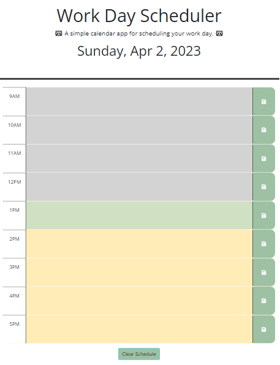

# Work Day Scheduler

## 05 Third-Party APIs: Work Day Scheduler

This weeks challenge will be so useful in helping me stay organised! We’re making a workday scheduler! Following the theme of ‘making our lives easier’, we were given starter code to work with! Even hints, yay! 

I think one of the biggest lessons I’ve learned from this challenge is that my code doesn’t have to be the most condensed (although it would be ideal if it was more legible and succinct), and as long as it FUNCTIONS as it should then I’ll be okay. I was paralyzed for the better part of an evening when I was struggling to write just one line of code so that the localStorage items display in their appropriate sections. After reaching out to AskBCS, Drew kindly helped me understand localStorage better, and showed me that it was okay to just have a line of code for EACH SECTION to display their stored contents. During my review before submitting the challenge, I realised that the code I put for this part had a PATTERN, and I WOULD be able to shorten it using some of the logic I used in other parts of my code! It was very exciting since this was originally how I envisioned to write it, but it just took me understanding how my code functions better first before I could do it! 

Other than this revelation, the trickier part of this challenge would likely be traversing the DOM, and accessing the elements that I needed, especially when all the sections are basically the same except for an ID. 
I feel like overall this one was pretty straightforward; and given access to libraries such as Day.js, it made the task much more manageable than if I didn’t have it. 
 

## Table of Contents

- [Deployment](#deployment)
- [Requirements](#requirements)
- [Usage](#usage)
- [Citations](#citations)
- [License](#license)

## Deployment

Link to my mini quiz: 

**https://jaychan0125.github.io/WorkDay-Scheduler/**


## Requirements

Here are the provided requirements:
## User Story
```md
AS AN employee with a busy schedule
I WANT to add important events to a daily planner
SO THAT I can manage my time effectively
```

## Acceptance Criteria
```md
GIVEN I am using a daily planner to create a schedule
WHEN I open the planner
THEN the current day is displayed at the top of the calendar
WHEN I scroll down
THEN I am presented with timeblocks for standard business hours
WHEN I view the timeblocks for that day
THEN each timeblock is color coded to indicate whether it is in the past, present, or future
WHEN I click into a timeblock
THEN I can enter an event
WHEN I click the save button for that timeblock
THEN the text for that event is saved in local storage
WHEN I refresh the page
THEN the saved events persist
```


## Usage

 
This workday scheduler helps you plan out your 9-5 work day! 
The blocks are colour coded to help: 
- gray: time past.
- green: current time.
- yellow: upcoming time.
As each hour passes, the colourblocks will also change! 
To enter your schedule, type your tasks into the text areas and hit the save button on the end. Don't worry! If you leave the page accidentally, your schedule will still be saved! 


## Citations

Maqsood, A., Moatar, T., Krishna, &amp; Zhang, S. (2023). Web APIs Day 1-3. Lecture. 

Drew. (2023). AskBCS.

## License

Licensed under the MIT license.

---


